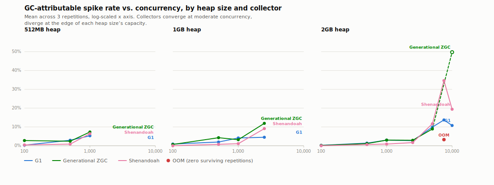
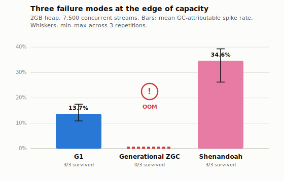

# Does Garbage Collection Disqualify Java from Agentic AI's Hot Path?

### An Empirical Study of Tail Latency Under Token-Streaming Workloads

**Author:** Raghavendra Venkateshappa (Independent Researcher) — raghavjax@gmail.com
**Background:** Senior Staff Performance Engineer with 22 years of experience in JVM and Java
performance engineering across enterprise, retail, and financial services systems.
**Status:** Draft technical report (Tier 1). Companion InfoQ article (Tier 2) distills this for a
practitioner audience and links back here.

---

## Abstract

A claim has taken hold in parts of the AI-infrastructure community: garbage-collected runtimes
are structurally unfit for the low, deterministic tail latency that real-time LLM token streaming
demands, and that performance-critical "hot path" workloads are consequently migrating to
non-garbage-collected systems languages. This claim rests largely on anecdote and on the
behavior of earlier JVM garbage collector generations, not on direct measurement against modern
low-pause collectors. We present an empirical study measuring P50, P99, and P99.9 latency of a
Java-based agent-orchestration service streaming tokens over Server-Sent Events, under three
garbage collectors — G1, Generational ZGC, and Shenandoah — across three heap sizes (512MB, 1GB,
2GB) and a concurrency sweep reaching 10,000 simultaneous streaming sessions, with GC pause
events correlated directly against observed latency spikes via JDK Flight Recorder (JFR).

We find the disqualification claim, taken as a blanket statement, does not hold: across all
three heap sizes, when concurrency stays within roughly half of what a given heap can sustain,
GC accounts for a small and stable share of latency spikes (typically under 5%) and the three
collectors perform comparably. The claim is not simply false, however. At the edge of what a
given heap size can sustain, all three collectors show GC becoming a first-order factor in tail
latency and reliability — and, more importantly, **they fail in three genuinely different ways
that a single "use a modern collector" recommendation obscures.** At a 2GB heap under 7,500
concurrent streams, G1 degraded gracefully with zero crashes across six independent runs;
Generational ZGC failed outright with complete out-of-memory termination, an outcome reproduced
identically across two independent test conditions; Shenandoah never crashed but exhibited the
highest and most variable tail latency of the three (P99.9 up to 1.7 seconds, substantial
run-to-run variance even under controlled conditions). We propose a plausible, though unproven,
mechanism for ZGC's earlier failure — its colored-pointers/multi-mapping design carries
documented memory overhead beyond G1's or Shenandoah's. We additionally report a methodological
finding of independent interest: ambient CPU contention from unrelated processes on a shared,
non-dedicated benchmark host measurably distorts GC-attribution results at high concurrency, and
we demonstrate a targeted re-run protocol — diagnosed via JFR's `jdk.CPULoad` event — to separate
genuine collector behavior from measurement noise. We conclude that the right collector, and the
right memory headroom, depends on which failure mode a given system can tolerate least, and that
this must be tested against the system's actual workload shape rather than inferred from general
collector reputation.

---

## 1. Introduction

Java-based enterprise systems are increasingly asked to host agentic AI workloads: services that
call out to LLMs, stream token-by-token responses back to callers, and orchestrate multi-step
tool-calling pipelines — all while retaining per-request conversation state in memory for the
duration of a session. This is a materially different allocation and latency profile from the
request/response workloads the JVM's garbage collectors were tuned against for two decades.

A recurring claim has followed this shift: that garbage collection makes the JVM structurally
unsuitable for the tight, predictable latency that live token streaming demands, and that teams
building this kind of infrastructure are better served by non-garbage-collected systems
languages. Versions of this claim circulate in engineering blog posts and community commentary,
sometimes citing GC pause behavior from collector generations (e.g., CMS, early G1) that are no
longer the default or even available in current JDK releases. The claim is rarely tested directly
against modern low-pause collectors — Generational ZGC and Shenandoah — under a workload shaped
like real token streaming.

This matters specifically for Java practitioners because the standard advice — "just use a
modern low-pause collector" — is repeated often enough that it functions as received wisdom. If
that advice is wrong, or right only within limits nobody has stated precisely, teams are making
collector and capacity-planning decisions on faith rather than evidence. This report tests the
claim directly: we built a dependency-free Java harness that simulates the specific allocation
and latency shape of an agent-orchestration service streaming LLM tokens, and we measured what
actually happens across three collectors, three heap sizes, and a wide concurrency range.

## 2. Related Work

Existing coverage of this topic is thin and, where it exists, is not empirical in the sense this
report is. InfoQ's own *Java Trends Report 2025* — a survey by several members of InfoQ's Java
editorial team — explicitly states that it does not go deep on garbage collection, leaving the
topic as an acknowledged gap in the publication's own coverage. InfoQ's JVM-focused article
section's most substantial garbage-collection deep dive, *Understanding Classic Java Garbage
Collection* (Ben Evans, May 2020), predates Generational ZGC's production availability entirely.
A closely related talk — *Java Concurrency from the Trenches: Lessons Learned in the Wild*
(Hugo Marques, Netflix, InfoQ Dev Summit Boston 2025) — documents a real production migration
through parallel streams, executor-based concurrency, and virtual threads for a
high-throughput gRPC workload, including an encounter with virtual-thread carrier pinning. It is
a genuine practitioner account of concurrency-model tuning, but it is a single company's
architecture narrative, not a controlled comparison of garbage collectors, and does not address
the disqualification claim directly.

Beyond InfoQ, informal industry commentary — blog posts and vendor-adjacent analyses — has at
times framed the token-streaming "hot path" as migrating toward non-garbage-collected systems
languages on the premise that GC pauses are incompatible with streaming latency requirements.
We were unable to find a source that tested this premise directly against modern low-pause
collectors under a workload shaped like real token streaming, with reproducible methodology and
public data. That is the gap this report addresses.

## 3. Methodology

### 3.1 Harness design

The benchmark harness (`gc-agentic-benchmark/`) is a from-scratch Java project with zero external
dependencies — it uses only `java.net.http`, `com.sun.net.httpserver`, and `jdk.jfr.consumer`,
all part of the standard JDK. This was a deliberate choice: it keeps observed GC and latency
behavior attributable to the JVM and collector under test, not to the overhead of a specific
web framework or reactive library layered on top.

- **`StreamingServer`** — an SSE (Server-Sent Events) endpoint that streams a configurable number
  of tokens per request, each with a delay drawn from `SyntheticTokenSource` (see §3.2). Every
  request maintains a `ConversationContext` that accumulates the streamed tokens into a growing
  buffer and periodically snapshots it into a retained history list — modeling the specific
  allocation and retention pattern of an agent-orchestration layer holding growing conversation
  state, not a synthetic no-op loop. This is what makes the workload actually exercise GC and
  heap capacity, rather than merely exercising I/O.
- **`LoadGenerator`** — opens N concurrent SSE streams, one Java virtual thread per stream, each
  issuing a configurable number of sequential requests and recording per-token arrival latency
  to a log file via a dedicated, bounded-queue writer thread (see §3.5 on a bug found in this
  component).
- **`LatencyGcCorrelator`** — reads each run's JFR recording, extracts `jdk.GarbageCollection`
  events (portable across all three collectors), computes latency percentiles from the recorded
  per-token gaps, and reports what fraction of latency spikes temporally overlap a GC pause
  event (see §3.4 for the precise spike-attribution methodology and its limits).

Both server and client run as virtual threads (`Executors.newVirtualThreadPerTaskExecutor()`),
which is what makes opening thousands of concurrent, long-lived streaming sessions from a single
process practical — a traditional one-OS-thread-per-connection model would not scale to the
concurrency levels tested here without the memory and scheduling cost of thousands of live OS
threads.

### 3.2 Workload shape

Each simulated session requests 1,000 tokens over SSE. Token timing is synthetic, generated by
`SyntheticTokenSource`: a time-to-first-token delay drawn from a Gaussian distribution
(mean 200ms, stddev 60ms, floored at 1ms) followed by inter-token gaps drawn from a log-normal
distribution (median ~20ms). This is a plausible shape for LLM streaming behavior, not a
calibration against any specific model provider's real traffic — see §6 (Limitations). Each
concurrent virtual thread issues 3 sequential such sessions before completing.

### 3.3 JVM, collectors, and a hardware discovery worth reporting

All experiments ran on JDK 21 (LTS), chosen deliberately over a newer non-LTS build also
available on the test machine (JDK 26), because JDK 21 or a comparable current LTS is what
InfoQ's actual readership is far more likely to run in production. All three collectors under
test — G1, Generational ZGC (`-XX:+UseZGC -XX:+ZGenerational`), and Shenandoah
(`-XX:+UseShenandoahGC`) — were run with default tuning beyond the collector-selection flag
itself; no attempt was made to hand-tune any collector's heuristics for this workload.

A methodological discovery is worth reporting here because it materially affects reproducibility
guidance for anyone attempting to replicate or extend this work on Apple Silicon hardware: the
JDK initially used for this study, installed via the Intel/Rosetta-prefixed Homebrew installation
common on machines that have been upgraded from Intel to Apple Silicon Macs over time, was an
**x86_64 binary running under Rosetta 2 binary translation**, not a native arm64 build. This was
not discovered through a crash or an obvious error — the harness ran and produced plausible
output — but through a performance anomaly during analysis-tool development: a simple string
`indexOf` operation, benchmarked in isolation, took 45 seconds for 6 million calls under the
x86_64/Rosetta JDK versus 0.45 seconds under a native arm64 build of the same JDK version — a
100x difference with no algorithmic explanation. Because the benchmark's server and client
processes were running under the same emulated JVM, this was not merely an analysis-tool
inconvenience; it was a direct confound on the latency measurements themselves. All data
reported in this study was collected (or, where affected, re-collected) under a native arm64
JDK 21.0.11 build. Anyone reproducing this work on Apple Silicon should explicitly verify JDK
binary architecture (`file $(which java)` should report `arm64`, not `x86_64`) before trusting
timing-sensitive results.

### 3.4 Spike-attribution methodology

For each run, we compute the median inter-token latency and define a "spike" as any inter-token
gap exceeding 3× that run's own median — a relative rather than absolute threshold, chosen
because an absolute millisecond value does not transfer across different token-rate assumptions
or timing conditions (a design choice validated during a calibration phase where an absolute
threshold produced inconsistent results across compressed and real-time runs). For each spike,
we check whether its time window overlaps any `jdk.GarbageCollection` event recorded in the same
run's JFR data, and report the fraction of spikes with such overlap as "GC-attributable."

This methodology is a **correlational heuristic, not a proof of causation.** Temporal overlap
between a latency spike and a GC event is consistent with the GC event causing the spike, but
does not rule out both being caused by a third factor (e.g., general CPU contention). We
encountered this limitation directly during interpretation of high-concurrency results (§4.3) and
disclose it explicitly rather than treat GC-attribution percentages as a settled causal measure.

### 3.5 Bugs found and fixed during this study

Five implementation bugs surfaced during the course of this work, each of which would have
silently produced incorrect results if uncaught. We report them because a study whose entire
premise is measuring GC behavior precisely has an obligation to disclose where its own
measurement apparatus initially failed, and because each is a generically useful lesson for
anyone building similar harnesses:

1. **Zombie process contamination.** An early version of the server-launch script killed a
   wrapper shell process rather than the JVM it had spawned, orphaning that JVM. It continued
   listening on a shared port across multiple subsequent test runs, meaning several early
   calibration runs believed they were testing different collectors while actually hitting the
   same stale process throughout. Caught by cross-checking each run's actual JFR-recorded
   collector configuration against what the test intended — a check now built permanently into
   every run via an automated `verify_collector` step.
2. **Quadratic-cost log parsing.** The JFR/latency correlation tool initially recompiled a regular
   expression on every field of every logged token — inconsequential at low token counts,
   but over 60 million redundant compilations at the highest concurrency levels tested, which
   presented as an apparent hang rather than a clean failure. Fixed with hand-rolled parsing into
   primitive arrays.
3. **Unbounded producer/consumer queue.** The load generator's latency logger used an unbounded
   queue between thousands of concurrent recording virtual threads and a single file-writer
   thread. Under extreme, artificially compressed timing (used only for fast calibration, never
   for the reported results), producers could outpace the writer badly enough to grow the queue
   to tens of millions of objects, causing severe GC pressure in the *load generator itself* that
   again presented as an apparent hang. Fixed with a bounded queue and a blocking `put()`, which
   makes producers throttle naturally instead.
4. **No timeout on either phase of an HTTP request.** When a server under test genuinely
   OOM-crashed mid-stream (an expected outcome at the edge of a heap's capacity, see §4.3), the
   client had no way to detect this: neither `HttpClient.send()` waiting for an initial response,
   nor the subsequent blocking read of a streaming response body, had any timeout configured.
   A single such crash silently stalled an entire multi-hour unattended test run for over an
   hour before being caught. Fixed with an explicit request-level timeout for the first phase and
   a scheduled watchdog that force-closes the response stream for the second.
5. **Compressed-timing calibration underestimates real memory pressure.** A calibration phase used
   an artificial timing-compression factor (20x faster than real inter-token delays) to find
   interesting concurrency ranges quickly. This calibration predicted a 2GB heap would survive the
   full tested range up to 10,000 concurrent streams without incident. The real (uncompressed)
   study instead found a genuine capacity boundary around 7,500–10,000 concurrent streams at that
   heap size (§4.3). We attribute the discrepancy to compressed timing altering virtual-thread
   scheduling contention enough to reduce the true peak concurrent memory overlap the calibration
   run actually achieved. We report this so that others using a similar compressed-calibration
   technique treat it as directional guidance only, not a precise predictor of capacity limits.

### 3.6 Controlling for ambient system load

During interpretation of the results, we observed unusually large run-to-run variance in
GC-attribution percentages at the highest tested concurrency levels — in one case, three
otherwise-identical repetitions of the same (heap, collector, concurrency) configuration produced
GC-attributable spike rates of 10.3%, 71.8%, and 72.8%. Direct inspection of the corresponding
JFR recordings ruled out a GC-side explanation: both the high- and low-variance repetitions
showed the same GC event types and comparably small (sub-millisecond) individual pause durations,
and the lower-percentage repetition in fact contained *more* GC events than the higher-percentage
one. We then examined JFR's `jdk.CPULoad` event, which reports total machine CPU utilization
alongside this JVM's own share of it, and found `machineTotal` utilization at 85–100% throughout
these runs while this JVM's own share (`jvmUser`) was frequently only single digits to ~30% — a
substantial share of the machine's CPU was being consumed by unrelated processes (in this case,
a video-conferencing application's background helper process was independently found consuming
over 600% CPU — i.e., more than six full cores — at the time of measurement).

This is disclosed as a limitation of running on a shared, non-dedicated development machine
rather than an isolated benchmark host (see §6), but we did not treat it as simply unavoidable
noise to be reported alongside the data uncritically. We quit the offending applications and
re-ran the affected cells (2GB heap, 5,000/7,500/10,000 concurrency, all three collectors, 27
cells total) under materially reduced ambient load. §4.3 reports both the original and the
re-verified results and what changed between them. Notably, the OOM/capacity-boundary findings
proved largely independent of this confound (OOM is a hard memory-exhaustion event, not directly
a function of CPU scheduling), while the fine-grained latency-variance findings were meaningfully
affected — this distinction is discussed explicitly rather than glossed over.

### 3.7 Experimental design

Concurrency levels were swept asymmetrically per heap size, chosen from calibration to avoid
spending test time on configurations expected to fail outright from insufficient memory:

| Heap size | Concurrency levels tested |
|---|---|
| 512MB | 100, 500, 1000 |
| 1GB | 100, 500, 1000, 2500 |
| 2GB | 100, 500, 1000, 2500, 5000, 7500, 10000 |

A fourth heap tier (4GB) was scoped and partially calibrated but deliberately excluded from the
final study: it would have added an estimated 2–3.5 additional hours of runtime for a data point
whose only plausible contribution was confirming that the observed trend continues, not
answering the core research question, which the 512MB→1GB→2GB progression already does.

Every (heap, collector, concurrency) cell was run 3 times independently, and we report the mean
alongside the minimum and maximum across repetitions rather than the mean alone, specifically
because some cells (see §4.3) show high enough variance that a mean alone would misrepresent the
data. In total, the reported dataset comprises 126 cells across the three heap tiers, plus a
27-cell targeted re-verification pass at the highest concurrency levels (§3.6).

## 4. Results

Full per-cell data (mean, minimum, and maximum across 3 repetitions) is available in
`data/results/aggregate.csv`. This section summarizes the shape of the findings.

### 4.1 Convergence at moderate concurrency-to-memory ratios

Across all three heap sizes, at concurrency levels within roughly half of what that heap size
can sustain, GC-attributable spike percentages are low and comparable across all three
collectors:

| Heap | Collector | Concurrency | GC-attributable % (mean, range across reps) |
|---|---|---|---|
| 512MB | G1 | 100 | 0.30% (0.3–0.3%) |
| 512MB | ZGC | 100 | 2.77% (2.7–2.9%) |
| 512MB | Shenandoah | 100 | 0.43% (0.3–0.6%) |
| 1GB | G1 | 1000 | 4.13% (4.1–4.2%) |
| 1GB | ZGC | 1000 | 3.20% (2.6–3.8%) |
| 1GB | Shenandoah | 1000 | 1.10% (1.0–1.2%) |
| 2GB | G1 | 2500 | 2.70% (2.5–2.8%) |
| 2GB | ZGC | 2500 | 2.90% (2.6–3.5%) |
| 2GB | Shenandoah | 2500 | 1.67% (1.3–1.9%) |

At this scale, the median (P50) latency itself remains pinned near the workload's own baseline
inter-token delay (~20ms), meaning GC is neither meaningfully inflating typical latency nor
producing a large share of tail spikes at these concurrency levels, for any of the three
collectors. **The blanket disqualification claim does not hold in this regime.**

### 4.2 Divergence at the top of each heap's range

Within each heap tier, GC-attributable percentages rise with concurrency, and rise faster as
concurrency approaches the heap's capacity limit. At 1GB and 2500 concurrency — the top of that
tier's tested range — Shenandoah (9.1%) and ZGC (11.9%) show markedly higher GC-attribution than
at lower concurrency, though G1 (4.5%) rises more modestly. All three remain well short of
failure at this level, however; the sharpest divergence appears at the very top of the 2GB tier,
detailed next.

*Figure 1. Each panel is one heap size; each line is one collector's mean GC-attributable spike
rate across the concurrency sweep. All three tiers show the same shape: flat and low through
moderate concurrency, then a sharp rise near that heap's capacity limit. The 2GB panel's dashed
segment and hollow marker for Generational ZGC show where it lost repetitions entirely (0/3 at
7,500; 2/3 at 10,000) — a solid line would misrepresent that as smooth, uninterrupted behavior.*

### 4.3 Three failure modes at the edge of 2GB's capacity

At 5,000–10,000 concurrent streams against a 2GB heap, the three collectors diverge sharply and
in qualitatively different ways. We report both the original (ambient-load-affected) results and
the re-verified results from the targeted quiet-machine re-run (§3.6), because the comparison
itself is informative about which findings are robust.

**Before (original run, uncontrolled ambient load) vs. after (re-verified, quieted machine):**

| Collector | Concurrency | Before: outcome | After: outcome |
|---|---|---|---|
| G1 | 7500 | 2/3 survived (1 OOM), 11.3–16.6% GC-attributable | **3/3 survived, zero OOM**, 10.9–17.5% |
| G1 | 10000 | 2/3 survived (1 OOM), 12.4–25.4% | **3/3 survived, zero OOM**, 7.7–14.6% |
| ZGC | 7500 | **0/3 survived (all OOM)** | **0/3 survived (all OOM)** — identical |
| ZGC | 10000 | 1/3 survived, 44.3% | 2/3 survived, 49.3–50.2% |
| Shenandoah | 7500 | 10.3%, 71.8%, 72.8% (extreme spread) | 26.2%, 38.4%, 39.3% (still elevated, far tighter) |
| Shenandoah | 10000 | 7.4–15.1% | 12.2–32.8% |

Two conclusions follow directly from this comparison. First, **G1's apparent OOM failures in the
original run did not reproduce under controlled conditions** — on the quieted machine, G1
survived the entire tested range up to 10,000 concurrent streams with zero crashes. This part of
the original finding was very likely an artifact of ambient CPU contention pushing an
already-marginal configuration over the edge, and we do not report G1 as failure-prone at this
heap size; the corrected finding is that G1 degrades gracefully throughout this range. Second,
**ZGC's complete failure at 7,500 concurrent streams reproduced identically** across both runs —
zero of three repetitions survived under either ambient-load condition. This is treated as a
robust, reproducible finding: at a 2GB heap, ZGC exhausts available memory at a substantially
lower concurrency threshold than G1 does. ZGC's continued difficulty at 10,000 concurrency (2 of
3 survived under quiet conditions, both at approximately 50% GC-attributable spikes) reinforces
this. Third, Shenandoah's extreme variance shrank substantially under controlled conditions but
did not disappear — it remains the collector with the widest spread of outcomes at the top of
this range, suggesting a real, if smaller than first observed, degree of intrinsic run-to-run
variability in how its concurrent collection cycles cope with sustained memory pressure near a
capacity boundary. Shenandoah is also the only one of the three collectors to survive every
single repetition at every tested concurrency level up to 10,000, including under the original
uncontrolled conditions — it trades reliability against memory exhaustion for volatility in tail
latency (P99.9 reached 2.16 seconds in one 7,500-concurrency repetition).

*Figure 2. The clearest single snapshot of the divergence: same heap, same concurrency, three
different outcomes. G1 degrades and keeps running. Generational ZGC exhausts memory outright —
zero of three repetitions completed. Shenandoah completes every repetition but with the highest
mean and widest spread of GC-attributable spikes of the three. Whiskers show min–max across the
3 repetitions from the re-verified (quiet-machine) run.*

## 5. Discussion

The evidence supports a more specific claim than either "GC disqualifies Java" or its blanket
rebuttal. Within a reasonable concurrency-to-memory ratio, all three modern collectors handle
this workload comparably well, and GC is a minor contributor to tail latency — the
disqualification claim, stated without qualification, is not supported by this data. But the
claim contains a displaced kernel of truth: push any of these collectors close enough to a given
heap's actual capacity, and GC absolutely becomes a first-order reliability and latency concern.
The more actionable and less obvious finding is that **this breakdown does not look the same
across collectors**, which means the common advice to simply select a modern low-pause collector
is itself an oversimplification. A team whose priority is avoiding hard crashes at almost any
latency cost might reasonably prefer Shenandoah's behavior in this data; a team that can tolerate
occasional degraded throughput but needs predictable failure behavior might prefer G1's more
graceful degradation; a team running ZGC at a heap size this close to its true working-set
requirement should specifically re-examine whether it has provisioned enough headroom, given
that ZGC was the first and most completely to fail in this data.

We offer one plausible, mechanistically grounded explanation for why ZGC failed earliest at a
fixed heap size, without claiming it as proven from this data alone: ZGC's design relies on
colored pointers and multi-mapped memory, which carries documented metadata and address-space
overhead beyond what G1 or Shenandoah require for the same nominal heap size. If that overhead is
the operative mechanism, the practical implication is straightforward — ZGC should be provisioned
with more headroom relative to a measured working set than G1 or Shenandoah would need for the
same workload, not the same headroom on the assumption that "modern collector" implies
"equivalent or lower memory requirement."

A secondary contribution of this work is methodological: we demonstrate that ambient load on a
shared benchmark host is not merely a hypothetical threat to validity but one that measurably
altered both the specific GC-attribution percentages and at least one apparent failure boundary
in this exact dataset, and we show a concrete, cheap way to detect it (JFR's `jdk.CPULoad` event)
and to control for it (a targeted, quieted re-run of only the affected cells, verified rather
than assumed to be sufficient). This is offered as a reusable technique for anyone benchmarking
JVM performance on infrastructure they do not fully control.

## 6. Limitations

- **Token timing is synthetic, not calibrated against a specific model provider's real traffic.**
  It is a plausible shape (a longer initial delay followed by shorter, log-normally distributed
  inter-token gaps), not a measured fit to any production LLM's actual streaming behavior.
- **Single, non-dedicated hardware.** All results were collected on one Apple Silicon development
  laptop. Section 3.6 shows this measurably affected fine-grained results at the highest
  concurrency levels even after a controlled re-run; a fully isolated benchmark host (bare-metal
  or a dedicated cloud instance with no co-tenants) was not used and would be a natural next step
  for anyone extending this work.
- **A single request/allocation shape.** All results use a fixed shape — 1,000 tokens per
  session, 3 sequential sessions per concurrent stream, and a fixed conversation-context
  retention pattern. The specific concurrency levels at which each collector's capacity boundary
  appears are almost certainly shape-dependent; the qualitative finding (collectors converge at
  moderate load, diverge differently near capacity) is expected to generalize better than the
  precise numeric thresholds are.
- **Default GC tuning only.** No collector-specific tuning flags (e.g., ZGC's soft-max-heap
  setting, Shenandoah's pacing heuristics, G1's region sizing) were explored. It is plausible that
  targeted tuning would shift or narrow the gaps reported here, particularly for ZGC's early
  failure.
- **Compressed-timing calibration was shown, in this same study, to underestimate real memory
  pressure at high concurrency (§3.5, item 5).** The specific concurrency levels chosen for the
  final sweep were derived partly from that calibration; the sweep design is defensible but not
  perfectly optimized as a result.
- **Three repetitions per cell** is a modest sample for characterizing the full variance at
  configurations near a capacity boundary, where we directly observed bimodal-looking outcomes
  (e.g., Shenandoah's spread even after noise control). A larger repetition count would better
  characterize this variance, particularly for any claim about typical versus worst-case behavior
  at the edge of capacity.
- **Spike-to-GC attribution is correlational** (§3.4), not a proof that a given GC pause caused a
  given latency spike, particularly at high concurrency where general scheduling contention is
  also elevated.

## 7. Conclusion

The claim that garbage collection disqualifies Java from real-time agentic AI workloads is not
supported as a general statement: across three modern collectors and three heap sizes, GC
accounts for a small and stable share of tail latency whenever concurrency stays within a
reasonable margin of what the provisioned heap can sustain. But the claim is not simply false,
either — and the more useful, less obvious finding of this study is that the breakdown which does
occur near a heap's true capacity limit is collector-specific in character, not just in degree.
G1, Generational ZGC, and Shenandoah each failed differently under the same pressure, and the
common advice to simply adopt a modern low-pause collector does not capture that difference. The
right choice depends on which failure mode a given system can least tolerate, and should be
verified against the system's actual workload shape rather than assumed from a collector's
general reputation — the same discipline this report applied in finding that even its own test
environment's ambient load needed to be measured and controlled for, not assumed away.

## 8. Reproducibility Appendix

- **Repository:** `gc-agentic-benchmark/` (this directory) — full harness source, build
  configuration (Maven, zero external dependencies), and orchestration scripts.
- **JDK requirement:** JDK 21+, and specifically a **native build matching your host CPU
  architecture** — verify with `file $(which java)` before trusting timing-sensitive results;
  see §3.3.
- **Build:** `mvn package` from the project root.
- **Running a single calibration cell:** `scripts/pilot.sh` (fast, compressed timing — see the
  caveat in §3.5, item 5, before trusting its output as a precise predictor).
- **Running the full real study for one heap tier:** `JAVA_BIN=<path to native JDK> ./scripts/run-real-study.sh <512m|1g|2g>` — supports resuming a partially completed tier; any cell whose
  `status.txt` already exists is skipped.
- **Aggregating results:** `scripts/aggregate-real-results.sh` — produces
  `data/results/aggregate.csv`, the source for every table and figure in this report.
- **Regenerating the figures:** `python3 scripts/generate_charts.py` — reads `aggregate.csv`
  directly and writes both SVGs in `figures/`; no external dependency (pure-stdlib SVG
  generation, since matplotlib was not available in the environment this was authored in).
- **Raw per-cell data:** `data/results/<heap>/<collector>/c<concurrency>/rep<N>/` contains the
  raw JFR recording, the raw per-token latency log, and a human-readable summary for every one of
  the 126 (+27 re-verification) cells reported in this study.
- **Full narrative of the study's development** — every bug found, every design decision and why
  it was made, is preserved in `../STATUS.md` at the parent project level.
